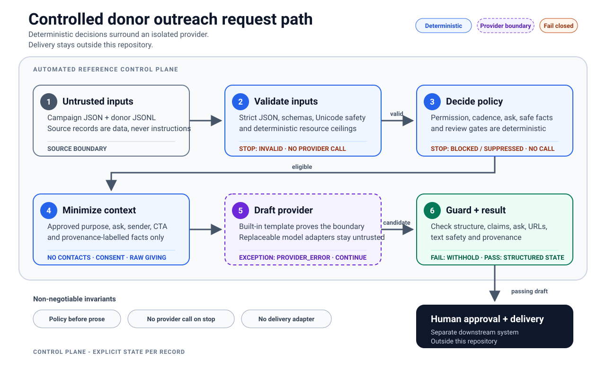

# Charity Donor Outreach

[](https://github.com/kappa9999/charity-donor-outreach-case-study/actions/workflows/ci.yml)

A portable Agent Skill and production-oriented Python reference implementation for creating
consent-aware, claim-grounded, human-reviewable donor outreach drafts.

The design treats fluent copy as the final step of a controlled workflow. Consent, contact
eligibility, ask amounts, approved facts, review gates, and output validation are enforced
outside the drafting provider. The project never sends a message.

All donor examples are either the mocked table supplied with the exercise or clearly labelled
synthetic scenarios. No real donor data, credentials, or unapproved organization claims are
included. This repository is the complete public submission and can be reviewed directly in
GitHub; no download or local HTML viewer is required.

## Reviewer path

1. Read [the case-study assessment](ASSESSMENT.md) for the issues, decisions, and expected impact.
2. Inspect the rewritten [Agent Skill](charity-donor-outreach/SKILL.md).
3. Review the [runtime architecture](docs/ARCHITECTURE.md) and trust boundaries.
4. Inspect the [behavioral evidence](docs/QUALITY.md) and tests.
5. Review the [sample provenance and expected outcomes](examples/README.md).
6. Run every reviewer-facing example with one command below.

## Direct response to the brief

The supplied scenario names the ASPCA. The rewritten skill is intentionally
organization-portable: approved organization and campaign facts are structured inputs rather
than hard-coded claims. The synthetic examples demonstrate the workflow without inventing or
publishing statements about the real charity.

| Requested outcome | Direct answer |
| --- | --- |
| Assess the supplied skill | [ASSESSMENT.md](ASSESSMENT.md) identifies the control, data, quality, and operating-model gaps. |
| Explain improvements, rationale, and impact | The assessment's problem/refinement/impact matrix and decision sections make each tradeoff explicit. |
| Rewrite the skill | [charity-donor-outreach/SKILL.md](charity-donor-outreach/SKILL.md) is the portable rewrite, supported by focused references and executable schemas. |
| Produce consistent, reliable outputs at growing-list scale | Deterministic policy and output guards provide consistency; strict contracts, review states, and adversarial tests provide reliability; per-record JSONL isolation, atomic writes, resource ceilings, and a replaceable provider seam provide scale. |
| Demonstrate behavior on the supplied data | The exact 50-row donor table is provenance-locked, transformed only through documented test controls, executed end to end, and compared with committed golden results. |

The assessment and rewritten skill are the two requested deliverables. The Python package,
architecture, schemas, synthetic examples, and quality evidence are supplementary proof that the
design is implementable and testable, not hidden requirements for using the portable skill.

The supplied table did not include consent, suppression, contact-path, exact-date, campaign, or
claim-approval controls. Its executable fixture keeps the original table separate and labels every
added demonstration control; production onboarding must obtain those values from authoritative
systems rather than copy the test defaults.

## System at a glance



Deterministic validation and policy own every consequential decision. The drafting provider sees
only minimized, approved context; independent guards validate its output; human approval and
delivery remain outside this repository. See [the architecture detail](docs/ARCHITECTURE.md).

## Safety properties

| Boundary | Enforced behavior |
| --- | --- |
| Permission and inputs | Denied/do-not-contact records are suppressed; unknown authority, missing data, malformed input, and policy conflicts stop before any provider call. |
| Policy | Eligibility, cadence, fixed-point ask calculation, fact selection, and review gates are deterministic and provider-independent. |
| Provider privacy | Donor IDs, contact data, consent controls, internal notes, and raw giving history never enter the drafting request. |
| Claims and output | Only approved provenance-labelled facts may be used; unsupported claims, contacts, URLs, numbers, asks, unsafe text, or malformed structure quarantine the entire candidate. |
| Human control | Relationship-managed/high-value drafts and every non-built-in provider result require review. `draft_ready` never grants delivery authority. |
| Batch and audit | Records fail independently, output replacement is atomic, resource use is bounded, and audit fields use stable codes without copying raw donor content. |

The detailed invariants, adversarial cases, and honest limits are mapped to tests in
[Quality evidence](docs/QUALITY.md).

## Quick start

Requires Python 3.11 or newer.

Create an isolated environment, then use its interpreter explicitly so activation state cannot
select the wrong Python.

### macOS/Linux

```bash
python -m venv --clear .venv-reviewer
.venv-reviewer/bin/python -m pip install -e ".[dev]"
.venv-reviewer/bin/python scripts/run_examples.py --output-dir out/reviewer-demo
```

### Windows PowerShell

```powershell
python -m venv --clear .venv-reviewer
.\.venv-reviewer\Scripts\python.exe -m pip install -e ".[dev]"
.\.venv-reviewer\Scripts\python.exe scripts\run_examples.py --output-dir out\reviewer-demo
```

That cross-platform command verifies the received-table fixture, runs the six realistic control
scenarios and all 50 supplied donor rows, and checks every generated byte against committed golden
outputs. It also writes `out/reviewer-demo/reviewer-summary.md` with a compact status table and
representative readable drafts. Expected totals are documented in
[examples/README.md](examples/README.md).

For a production-shaped batch using your own validated inputs, keep using the environment's
interpreter:

```bash
.venv-reviewer/bin/python -m charity_donor_outreach generate \
  --campaign examples/campaign.json \
  --donors examples/donors.jsonl \
  --output out/results.jsonl
```

```powershell
.\.venv-reviewer\Scripts\python.exe -m charity_donor_outreach generate `
  --campaign examples\campaign.json `
  --donors examples\donors.jsonl `
  --output out\results.jsonl
```

The command prints only aggregate counts. Drafts and structured decisions are written atomically
to the requested JSONL path. The CLI rejects an output path that aliases either input.

Expected example dispositions:

| Donor | Result | Why |
| --- | --- | --- |
| SYN-001 | draft_ready | Explicit permission and complete inputs |
| SYN-002 | blocked | Permission is unknown |
| SYN-003 | suppressed | Do-not-contact flag is set |
| SYN-004 | review_required | Relationship-managed segment and high-value ask |
| SYN-005 | draft_ready | Complete postal-letter path |
| SYN-006 | suppressed | Contact-frequency limit |

## Result states

| State | Provider called | Draft returned | Intended action |
| --- | :---: | :---: | --- |
| invalid | No | No | Correct the source record |
| blocked | No | No | Resolve missing or ambiguous authority/data |
| suppressed | No | No | Do not create outreach |
| provider_error | Yes | No | Retry or investigate the provider |
| quality_rejected | Yes | No | Review the quarantined failure reason |
| review_required | Yes | Yes | Human approval required |
| draft_ready | Yes | Yes | Continue through the organization's approval process |

"Draft ready" is not "approved to send." This repository has no delivery adapter.

## Repository structure

```text
charity-donor-outreach/        Portable skill, references, and JSON Schemas
src/charity_donor_outreach/    Executable policy and provider boundaries
tests/                         Behavioral, adversarial, contract, and CLI tests
examples/                      Realistic controls, supplied-table fixture, and golden outputs
  jll-supplied/                Exact source table, lineage, operational fixture, and results
docs/                          Architecture, decisions, evidence, and limitations
scripts/                       One-command examples, fixture checks, and maintenance utilities
.github/workflows/ci.yml       Windows and Linux quality gate
```

## Design scope

The included template provider makes local runs and CI deterministic. A production model adapter
can implement the small DraftProvider protocol, but it receives only the minimized DraftRequest
as structured data and remains subject to the same output guard. Output from any provider other
than the exact built-in deterministic implementation is always review_required, even when every
automated check passes. Adapters must preserve role separation between instructions and untrusted
field values. Vendor credentials, automatic delivery, prospect scoring, legal consent
determination, and real donor data are intentionally excluded.

The committed schemas declare JSON Schema Draft 2020-12. Money and multiplier inputs use bounded
canonical ASCII decimal strings, currencies use the pinned active ISO 4217 List One snapshot, and
dates use exact valid YYYY-MM-DD strings, so schema consumers and the runtime interpret the same
lexical values. The Pydantic runtime remains authoritative for ordered cross-field comparisons
that standard JSON Schema cannot express.

Cross-field phone reconstruction uses a pinned Google libphonenumber metadata snapshot for
assigned E.164 calling codes and possible national-number lengths. That keeps uncued numeric
fragment checks reproducible while rejecting implausible combinations of unrelated years and
counts; explicit phone labels and cues remain fail-closed independently of the snapshot.

This is a reference control plane, not a claim that generic automated checks prove every sentence
factually correct. Production rollout would also require organization-specific legal/privacy
review, data-retention controls, access controls, provider contracts, monitoring, and calibrated
human evaluation.

## Standards and context

- [Agent Skills specification](https://agentskills.io/specification)
- [JLL Responsible AI Statement](https://www.jll.com/en-ca/responsible-ai-statement)
- [NIST AI Risk Management Framework Core](https://airc.nist.gov/airmf-resources/airmf/5-sec-core/)
- [SIX ISO 4217 current currency lists](https://www.six-group.com/en/products-services/financial-information/market-reference-data/data-standards.html)
- [ITU-T E.164 international numbering plan](https://www.itu.int/rec/T-REC-E.164/en)
- [Google libphonenumber metadata source](https://github.com/google/libphonenumber/blob/99ade73f8465edd4a71969c8899bc45a854ed100/resources/PhoneNumberMetadata.xml)
- [ASPCA Privacy Policy](https://www.aspca.org/about-us/privacy-policy)
- [AFP Donor Bill of Rights](https://afpglobal.org/donor-bill-rights)

## License

MIT. See [LICENSE](LICENSE).
