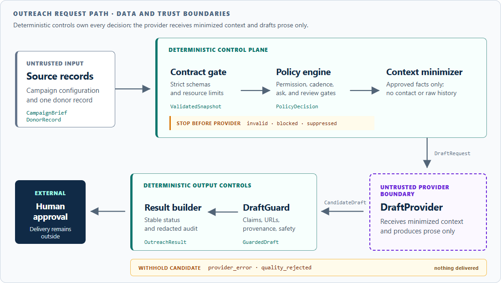

# Architecture and control boundaries

## Request path

The system map groups deterministic work into control and output planes so the request path remains
readable at README width. Those planes own validation, policy, minimization, output checks, and
result construction. The dashed `DraftProvider` boundary receives only `DraftRequest` and returns
`CandidateDraft`; it cannot decide policy. Amber status rails distinguish stops before a provider
call from candidates withheld afterward, and human approval remains external.

## Components

| Component | Responsibility | Explicitly cannot do |
| --- | --- | --- |
| Strict JSON and Pydantic contracts | Reject duplicate members, non-standard or oversized JSON, invalid UTF-8/Unicode 14 text, noncanonical dates/financial values or currency codes, missing/malformed/inconsistent fields, undeclared input, and resource-amplifying structures | Guess defaults for consent or contactability |
| Policy engine | Decide generation eligibility, cadence, ask, safe facts, and review gates | Write donor-facing prose |
| DraftRequest builder | Construct the minimum provider context | Include contact details, donor ID, or raw giving history |
| DraftProvider | Produce subject/body and declare fact IDs used | Decide consent, ask amount, or review status |
| DraftGuard | Anchor required paragraphs; enforce provenance, URLs/URI schemes, contacts, numbers, claims, ask, text safety, and bounded lexical checks | Prove every natural-language statement semantically true |
| OutreachService | Isolate per-record failures and build structured results | Send outreach |
| CLI/I/O | Stream JSONL input, reject input/output aliases, and atomically replace the result file | Log raw donor records or overwrite an input |

## Trust boundaries

### Donor and CRM input

Donor data is untrusted. Extra fields are rejected; donor facts must carry CRM provenance; and
instruction-like, policy-control-like, raw-giving, solicitation-like, monetary, and contact-like
fact text is removed before provider invocation. Joined identity views carrying literal,
defanged, encoded, Unicode-domain, phone, IP, URI-scheme, or postal-contact shapes block before a
salutation is built. Exact structured email/address values and the donor identifier are also
screened from identity text, fact text, and fact IDs so they cannot be smuggled through an
otherwise provider-bound field. Component-aware bounded grammars also inspect non-adjacent and
reordered field fragments for reconstructed contacts, international phones, escape sequences,
instructions, internal controls, solicitation, giving terms, and currency-plus-amount content;
ordinary prose and unrelated counts remain explicit negative controls.
Email and postal data are used only to establish that required selected-channel fields are present
and satisfy the declared syntax. Email uses a conservative ASCII dot-atom and DNS-label contract;
postal fields are bounded safe text plus a two-uppercase-letter country-code shape. Neither check
proves mailbox/address deliverability, which is an upstream CRM and approval responsibility.
Contact data is not copied into the DraftRequest.

### Campaign configuration

Campaign configuration is controlled input, not executable instruction. The service rejects
instruction-like fields, internal policy/giving labels, contact details, monetary expressions,
and policy-bypassing solicitation.
Call-to-action URLs require canonical lowercase HTTPS, a valid
ASCII DNS host, a safe literal path, and no credential, port, query, fragment, percent encoding,
or unsafe character. Campaign facts must use campaign or organization provenance.

### Draft provider

The built-in provider is deterministic; external providers are potentially nondeterministic and
fallible. Each receives a frozen, detached deep copy of the minimized contract, while the guard
retains an independent deep snapshot and the service retains authoritative policy/campaign
objects. Mapping-like provider output is bounded and materialized once into an exact plain
snapshot before contract validation and guard evaluation. Production adapters must preserve instruction/data role
separation and delimit every untrusted field. Provider identity is validated and cached at
initialization; generation exceptions are contained per record. A candidate must pass independent
validation; failure returns no draft. A passing external-provider candidate still returns
review_required and can never become draft_ready in this implementation.

### Human and delivery systems

Human approval and message delivery are a separate downstream boundary. No SMTP, Gmail, CRM
write, print-mail, or marketing-automation adapter exists in this repository.

## Policy order

1. Reject structurally invalid records.
2. Suppress explicit do-not-contact and denied-permission records.
3. Block unknown permission, missing channel contact, unsafe/contact/policy/giving-like identity
   text, donor-ID tokens in identity, future contact/gift dates, giving-currency mismatch,
   duplicate fact IDs, and missing ask basis.
4. Suppress records inside the configured contact-frequency window.
5. Compute and bound the ask from canonical fixed-point strings with Decimal arithmetic, then
   create the exact policy-owned ask paragraph.
6. Remove unapproved, instruction-like, policy-control-like, raw-giving, solicitation-like,
   monetary, contact-like, and donor-identifier-exposing facts; redact sensitive excluded IDs.
7. Mark configured segments, high-value asks, removed unsafe facts, and non-built-in providers for
   review.
8. Call the provider only when generation remains allowed.
9. Quarantine candidates that fail structural, provenance, text-safety, or output checks.

Security-sensitive lexical comparisons use both Unicode NFKC normalization and a mark-stripped
NFKD skeleton without rewriting the approved display text. This closes bounded compatibility and
combining-mark variants of money, instructions, internal controls, contact details, URLs, numbers,
pressure, claims, and prohibited phrases while preserving exact structural checks. An explicit
Unicode 14 unsafe code-point table rejects unassigned/private-use ranges and pins behavior across
the supported Python 3.11 through 3.14 range.

This ordering makes the key invariant observable: blocked and suppressed results always record
provider_called=false.

## Data flow and minimization

| Field | Policy layer | Provider | Result |
| --- | :---: | :---: | :---: |
| donor_id | Yes; token-screen provider-bound text/IDs | No | Yes, for caller correlation |
| email/postal address | Contactability check only | No | No |
| consent/do-not-contact | Yes | No | Reason code only |
| raw giving history and currency | Ask calculation and integrity checks | No | No |
| computed ask | Yes | Yes | Yes |
| approved fact text | Eligibility filter | Yes | Fact IDs used |
| unapproved/instruction/policy/raw-giving/solicitation/money/contact/donor-ID fact data | Excluded | No | Safe excluded ID or fixed redaction sentinel |

The input fingerprint is a one-way SHA-256 digest used for change correlation. Valid input is
fingerprinted after normalization with the campaign. Malformed input is represented only by a
digest of the raw line bytes, then fingerprinted with the campaign, so two different malformed
lines do not collapse to one event and raw bytes are never emitted. This is not an anonymization
claim and should still be protected as operational metadata in production.

Canonical fingerprint encoding tags scalar and container types, so a JSON numeric token cannot
collide with the same characters supplied as a string. JSON nesting is bounded iteratively before
fingerprinting or model validation. Campaign files and donor lines are capped at 1 MiB. Direct
Mapping inputs also enforce depth, node, collection, scalar-content, fact, cycle, and shared-
reference ceilings. A direct Mapping is then materialized once into a bounded plain tree with
base-type scalar materialization and rechecked; fingerprinting and Pydantic validation consume
that same snapshot, preventing stateful mappings or hostile scalar subclasses from presenting
inconsistent values across security decisions. Structurally
oversized direct inputs use a bounded rejection-summary fingerprint, preventing audit work from
amplifying an invalid object graph.

Validation diagnostics preserve declared field names and numeric collection indexes only. An
unknown member name is untrusted content and becomes `$extra`, preventing PII embedded in a key
from being copied into output. At most 25 diagnostics are returned; a stable truncation sentinel
replaces the tail when more errors exist.

## Key decisions and reversal triggers

| Decision | Alternative | Why this version | What would reverse it |
| --- | --- | --- | --- |
| Deterministic template provider by default | Bundle a live model SDK and key setup | Keeps CI offline and proves controls without vendor behavior | Approved vendor and deployment environment |
| Provider protocol, not a generic framework | Multi-provider plugin registry | Smallest seam needed for substitution and tests | Multiple deployed providers with shared lifecycle needs |
| Canonical ASCII fixed-point strings, active ISO 4217 codes, Decimal, and exact YYYY-MM-DD campaign date | JSON floats, arbitrary codes, mixed-script digits, coercive dates, and current system time | Schema/runtime parity and reproducible money/cadence decisions | Update the dated ISO snapshot through a reviewed release |
| Pinned E.164 calling codes and possible national-number lengths for uncued cross-field reconstruction | Treat every short numeric group as a country code | Preserves deterministic privacy checks without classifying unrelated years and counts as phone numbers | A reviewed numbering-metadata update or a deployment-approved phone-validation service |
| Strict JSONL and per-record results | One monolithic batch response | Rejects parser ambiguity while preserving failure isolation and streaming integration | Transactional all-or-nothing business requirement |
| Structural/literal/numeric/URL output checks plus external-provider review | Claim semantic truth | Deterministic checks are defensible; semantic grounding remains a human/eval problem | Approved claim-verification service with measured performance |
| No delivery adapter | Send after draft_ready | Keeps generation separate from consequential external action | Authenticated approval workflow with idempotent delivery controls |

## Failure behavior

- Input validation failure: invalid, no provider call.
- Policy conflict or missing authority: blocked/suppressed, no provider call.
- Provider exception or invalid provider contract: provider_error, next record continues.
- Output invariant failure: quality_rejected, candidate body is not returned.
- Review gate: review_required with a draft, never auto-delivered.
